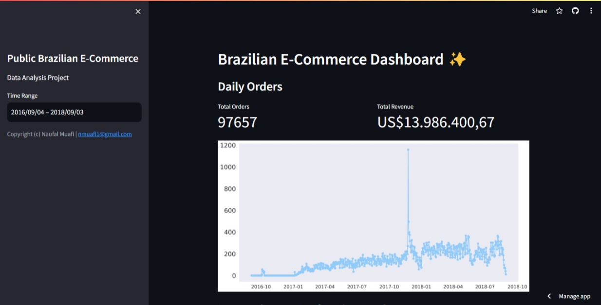

# E-commerce Analysis Project

This repository contains an analysis project focused on Brazilian e-commerce data. The dataset used in this project is sourced from [Kaggle](https://www.kaggle.com/datasets/olistbr/brazilian-ecommerce). The dataset provides valuable insights into e-commerce activities in Brazil.

## Dataset Overview

The dataset is obtained from Kaggle and includes various tables related to Brazilian e-commerce. It contains information about customers, orders, products, sellers, reviews, and more. The data is valuable for understanding e-commerce trends and patterns in Brazil.
This is real commercial data, it has been anonymised, and references to the companies and partners in the review text have been replaced with the names of Game of Thrones great houses.

## Prerequisites

To run this project, you'll need to set up a virtual environment using [pipenv](https://pipenv.pypa.io/en/latest/). Below is a list of required packages and dependencies:

```bash
pip install pipenv
pipenv install
pipenv shell
```

### Project Dependencies

```ini
[packages]
numpy = "*"
pandas = "*"
scipy = "*"
matplotlib = "*"
seaborn = "*"
streamlit = "*"
babel = "*"

[dev-packages]
ipykernel = "*"
```

Please ensure that you have the specified dependencies installed in your virtual environment before running the project.

## Dashboard

To access dashboard, you can go to [E-Commerce Analysis Dashboard](https://e-commerce-analysis.streamlit.app/).


To run dashboard on localhost, you can start with:
```bash
cd ./dashboard
streamlit run dashboard.py
```

## Contact Information
This project was created by:

Naufal Mu'afi
Email: nmuafi1@gmail.com

Feel free to reach out if you have any questions or feedback regarding this project.
